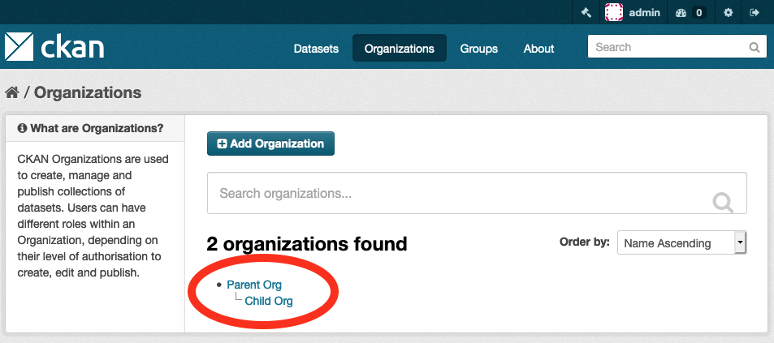
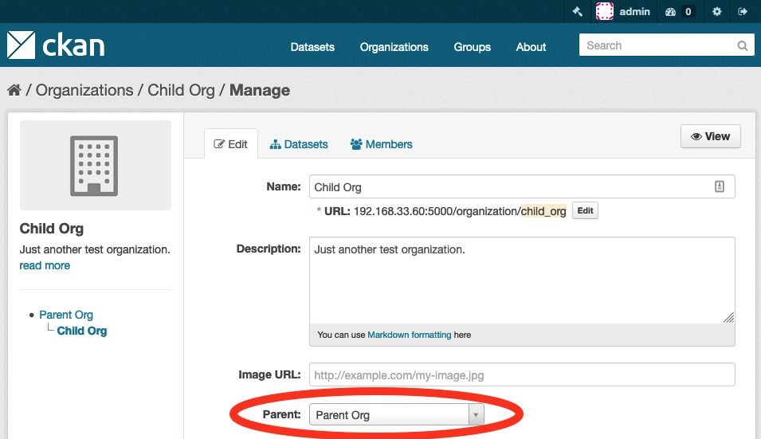
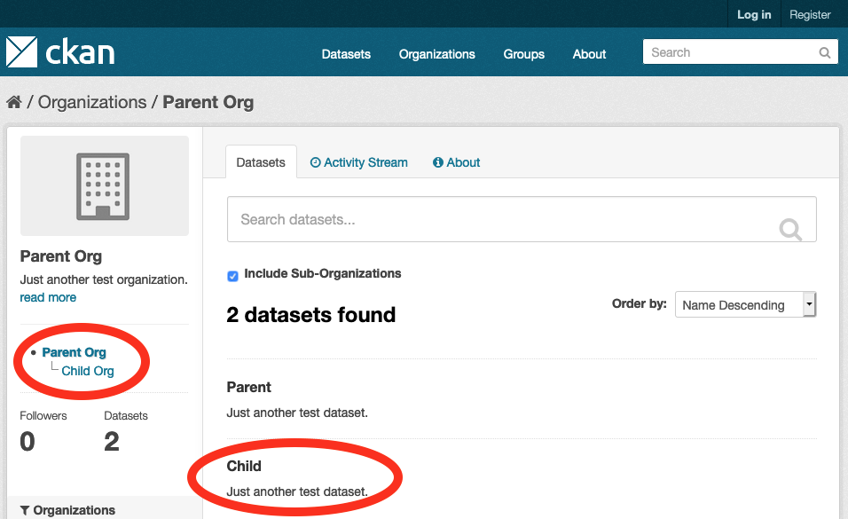

[](https://travis-ci.org/davidread/ckanext-hierarchy)

[](https://pypi.org/project/ckanext-hierarchy/)

[](https://pypi.org/project/ckanext-hierarchy/)


# ckanext-hierarchy - Organization and group hierarchy for CKAN

Organizations and groups can be arranged into a tree hierarchy.

This new hierarchical arrangement of organizations and groups is displayed
using templates in this extension, instead of the usual list:


Provides a new field on the organization and group edit form to select a parent
organization:


When viewing an organization you see its context within the tree in the side bar. In addition you can widen search of the organization's datasets to include datasets in sub-organizations too:


## Technical details

Forms (hierachy_form plugin):
* /organization/new
* /organization/edit/{id}
* /group/new
* /group/edit/{id}

Templates (hierarchy_display plugin):
* /organization - now shows the organization hierarchy instead of list
* /organization/about/{id} - now also shows the relevant part of the hierarchy
* /group - now shows the group hierarchy instead of list
* /group/about/{id} - now also shows the relevant part of the hierarchy

Snippets (used by hierarchy_display and ckanext-scheming):
* /scheming/form_snippets/org_hierarchy.html

You can use this extension with CKAN as it is, enabling both plugins. Or if you
use an extension to customise the form already with an IGroupForm, then you
will want to only use the hierarchy_display plugin, and copy bits of the
hierarchy_form and/or hierarchy_group_form into your own. If you have your own templates then you can use
the snippets (or logic functions) that this extension provides to display the
trees.

In order to make hierarchy work with ckanext-scheming you need to enable just
hierarchy_display and then use corresponding form_snippet in your org_schema or group_schema.
For example, you may add next field:
```
{
    "field_name": "not_used",
    "label": "Parent organization",
    "display_snippet": null,
    "form_snippet": "org_hierarchy.html",
    "validators": "ignore_missing"
}
```

Optionally one could also specify a full name and leave the field 'title' for
the short name or acronym (more convenient for  display).
```
{
    "field_name": "longname",
    "label": "Full Name",
    "validators": "ignore_missing unicode",
    "form_snippet": "large_text.html",
    "form_attrs": {"data-module": "slug-preview-target"},
    "form_placeholder": "My Organization full name",
    "display_snippet": null
}
```

TODO:
* make the trees prettier with JSTree

## Requirements

This extension requires CKAN v2.7 or later.

## Installation

To install ckanext-hierarchy:

1. Activate your CKAN virtual environment, for example:

       . /usr/lib/ckan/default/bin/activate

2. Install the ckanext-hierarchy Python package into your virtual environment:

       cd /usr/lib/ckan/default/src
       pip install -e "git+https://github.com/davidread/ckanext-hierarchy.git#egg=ckanext-hierarchy"
       pip install -r ckanext-hierarchy/requirements.txt

3. Add ``hierarchy_display``, ``hierarchy_form`` and/or ``hierarchy_group_form`` to the ``ckan.plugins`` setting in your CKAN
   config file (by default the config file is located at
   ``/etc/ckan/default/production.ini``). Note that hierarchy_display
should come before hierarchy_form and hierarchy_group_form

   e.g.:

       ckan.plugins = stats text_view recline_view ... hierarchy_display hierarchy_form hierarchy_group_form

4. Restart CKAN. For example if you've deployed CKAN with Apache on Ubuntu:

        sudo service apache2 reload

## Config settings

None at present

## Tests

To run the tests, do::

    nosetests --nologcapture --with-pylons=test.ini

To run the tests and produce a coverage report, first make sure you have
coverage installed in your virtualenv (``pip install coverage``) then run::

    nosetests --nologcapture --with-pylons=test.ini --with-coverage --cover-package=ckanext.hierarchy --cover-inclusive --cover-erase --cover-tests


## Releasing a new version of ckanext-hierarchy

ckanext-hierarchy should be available on PyPI as https://pypi.org/project/ckanext-hierarchy.
To publish a new version to PyPI follow these steps:

1. Update the version number in the ``setup.py`` file.
   See `PEP 440 <http://legacy.python.org/dev/peps/pep-0440/#public-version-identifiers>`_
   for how to choose version numbers.

2. Make sure you have the latest version of necessary packages:

       pip install --upgrade setuptools wheel twine

3. Create a source and binary distributions of the new version:

       python setup.py sdist bdist_wheel && twine check dist/*

   Fix any errors you get.

4. Upload the source distribution to PyPI:

       twine upload dist/*

5. Commit any outstanding changes:

       git commit -a

6. Tag the new release of the project on GitHub with the version number from
   the ``setup.py`` file. For example if the version number in ``setup.py`` is
   0.0.1 then do:

       git tag 0.0.1
       git push --tags

## Licence and copyright

This module is openly licensed with AGPLv3 - see LICENSE file.

Copyright belongs to commit authors. Commits 2013-2017 by @davidread are Crown Copyright.
